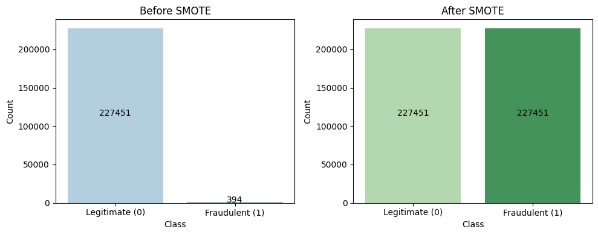
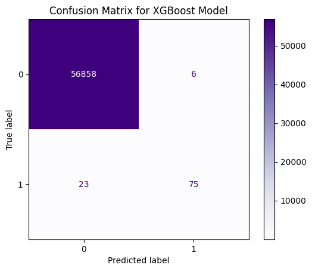
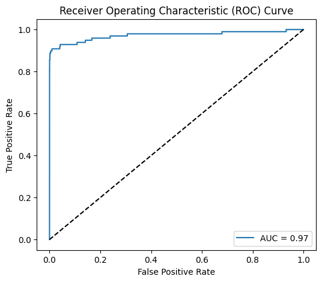
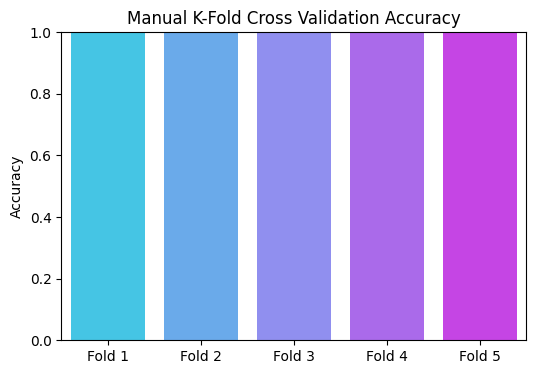
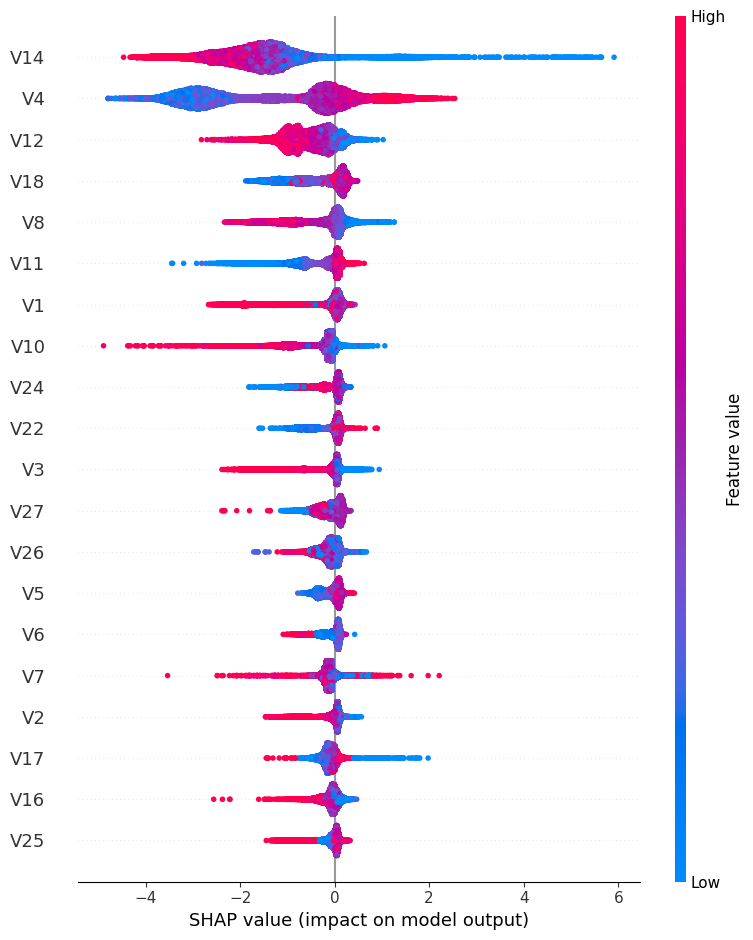

# 💳 Explainable Credit Card Fraud Detection System


## 📌 Overview
An AI-powered system designed to detect fraudulent credit card transactions with high precision. This project addresses the critical challenge of **class imbalance** (only 0.17% fraud cases) by utilizing **SMOTE** (Synthetic Minority Over-sampling Technique) and **XGBoost**. Crucially, it integrates **SHAP (SHapley Additive exPlanations)** to provide transparency, explaining *why* a specific transaction was flagged.

## 🚀 Key Features
* **Advanced Modeling:** Utilized **XGBoost Classifier** optimized for high Recall.
* **Imbalance Handling:** Balanced the dataset from a 0.17% fraud rate to a 50/50 split using **SMOTE**.
* **Explainability:** Integrated **SHAP** values to identify top risk drivers (e.g., Feature V14, V4).
* **Robust Validation:** Validated using **Stratified 5-Fold Cross-Validation** to ensure the model generalizes well.

## 📊 Methodology & Results

### 1. Handling Class Imbalance (SMOTE)
*Real-world fraud data is highly imbalanced. I used SMOTE to synthesize minority class instances, ensuring the model learns effectively.*


### 2. Model Performance (Confusion Matrix)
*The model successfully detected **77% of actual fraud cases** (Recall) while maintaining high precision, minimizing false alarms.*


### 3. ROC-AUC Curve
*Achieved an **AUC score of 0.97**, demonstrating excellent capability in distinguishing between legitimate and fraudulent transactions.*


### 4. Model Robustness (K-Fold CV)
*Consistent accuracy across 5 different data splits proves the model is stable and not overfitting.*


### 🔍 Explainable AI (XAI) Analysis
**Why did the model predict fraud?**
Using SHAP, we identified that features **V14**, **V4**, and **V12** are the strongest indicators of fraud. Lower values of V14 (blue dots on the left) significantly increase the risk of a transaction being flagged.


## 🛠️ Tech Stack
* **Language:** Python
* **Libraries:** Pandas, NumPy, Scikit-Learn, Imbalanced-Learn
* **Model:** XGBoost
* **Explainability:** SHAP
* **Visualization:** Matplotlib, Seaborn

## 💻 Usage
1. Clone the repository:
   ```bash
   git clone [https://github.com/Sage9643/Explainable-Credit-Card-Fraud-Detection.git](https://github.com/Sage9643/Explainable-Credit-Card-Fraud-Detection.git)
